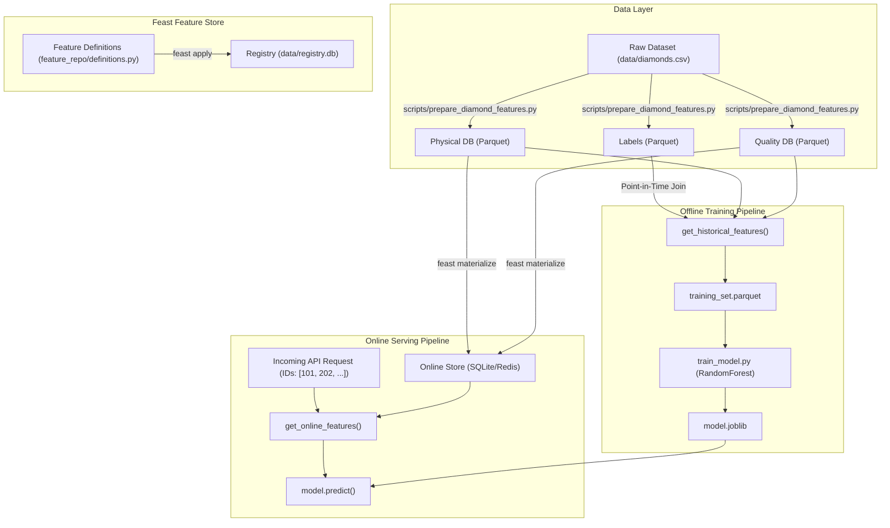

# Feast Feature Store — End-to-End Workflow Demonstration

[](https://feast.dev/)
[](https://python.org)
[](https://scikit-learn.org)

A complete, self-contained demonstration of the **Feast Feature Store** workflow for production Machine Learning systems using tabular data.

---

## Overview: Why Use a Feature Store?

In production Machine Learning systems, feature stores address two core challenges:

1. **Data Leakage and Inconsistency in Offline Training:** In historical time-series datasets, joining features naively on entity identifiers can leak future information into past training samples. Feast executes **point-in-time correct joins** (time-travel joins) to ensure every label is joined only with feature values known *at or before* that event's timestamp.
2. **Training-Serving Skew in Real-Time Inference:** Models frequently degrade in production when online feature engineering logic diverges from offline pipelines. Feast provides a unified feature definition layer, serving pre-materialized features from a low-latency key-value store (SQLite/Redis) at inference time with single-digit millisecond latency.

---

## Architecture



---

## Project Structure

```text
.
├── data/
│   └── diamonds.csv                  # Raw source dataset
├── feature_repo/
│   ├── feature_store.yaml            # Feast configuration (registry & stores)
│   ├── definitions.py                # Entities, sources, and feature views as code
│   └── data/                         # Runtime generated databases and parquet files
├── scripts/
│   ├── prepare_diamond_features.py   # Simulates upstream data producers
│   ├── build_training_set.py         # Offline feature retrieval (point-in-time joins)
│   ├── train_model.py                # Model training (RandomForestRegressor)
│   └── serve_online.py               # Online low-latency feature retrieval & inference
├── commands.sh                       # Sequential shell execution script
├── requirements.txt                  # Python dependencies
├── .gitignore                        # Git ignore rules for environments and artifacts
└── README.md                         # Project documentation
```

---

## Quickstart & Demonstration Walkthrough

### 0. Environment Setup

```bash
python3 -m venv .venv
source .venv/bin/activate
pip install -r requirements.txt
```

---

### Step 1: Simulate Upstream Data Sources
In enterprise environments, features are generated across multiple independent databases and microservices. Run the preparation script to simulate separate data pipelines:

```bash
python3 scripts/prepare_diamond_features.py
```

* **Function:** Reads `data/diamonds.csv` and partitions it into three distinct parquet tables in `feature_repo/data/`:
  - `physical_features.parquet` (Team 1: `carat`, `depth`, `table`, `x`, `y`, `z`)
  - `quality_features.parquet` (Team 2: `cut`, `color`, `clarity`)
  - `labels.parquet` (Target / Business: `price` and `event_timestamp`)

---

### Step 2: Declare Features as Code & Apply
Feature views and entities are defined declaratively in `feature_repo/definitions.py`.

Apply these definitions to the central Feast registry:

```bash
feast -c feature_repo apply
```

* **Function:**
  - Registers the `diamond` entity and two feature views (`diamond_physical` and `diamond_quality`).
  - Initializes metadata in `feature_repo/data/registry.db` and online store tables in `feature_repo/data/online_store.db`.

---

### Step 3: Explore Feast Web UI (Optional)
Launch the interactive web UI to visually inspect entities, feature views, and schemas:

```bash
feast -c feature_repo ui
```
* Access the interface at `http://localhost:8888`.
* Use `Ctrl + C` in the terminal to terminate the UI server.

---

### Step 4: Build Historical Training Set (Point-in-Time Joins)
Retrieve historical features for training while preventing future data leakage:

```bash
python3 scripts/build_training_set.py
```

* **Core Implementation (`scripts/build_training_set.py`):**
  ```python
  store = FeatureStore(repo_path="feature_repo")
  training_df = store.get_historical_features(
      entity_df=labels,
      features=[
          "diamond_physical:carat", "diamond_physical:depth", "diamond_physical:table",
          "diamond_physical:x", "diamond_physical:y", "diamond_physical:z",
          "diamond_quality:cut", "diamond_quality:color", "diamond_quality:clarity",
      ],
  ).to_df()
  ```
* **Output:** Generates `feature_repo/data/training_set.parquet`.

---

### Step 5: Train Machine Learning Model
Train a Random Forest regressor on the point-in-time feature set:

```bash
python3 scripts/train_model.py
```

* **Output:** Evaluates Mean Absolute Error (MAE) on the test split and serializes the trained model to `feature_repo/data/model.joblib`.

---

### Step 6: Materialize Features to Online Store
Sync the latest feature values from offline batch storage into the low-latency online key-value store (SQLite):

```bash
feast -c feature_repo materialize 2024-01-01T00:00:00 $(date -u +"%Y-%m-%dT%H:%M:%S")
```

---

### Step 7: Real-Time Online Inference (Zero Skew)
Simulate incoming production prediction requests:

```bash
python3 scripts/serve_online.py
```

* **Function:** The application receives only entity IDs (e.g., `[101, 202, 303]`). Feast fetches pre-materialized features from the online store in milliseconds and passes them directly to `model.predict()`.

---

## Resetting the Workspace

To remove all generated databases, parquet files, and model artifacts before a live presentation:

```bash
rm -rf feature_repo/data && mkdir -p feature_repo/data
```
